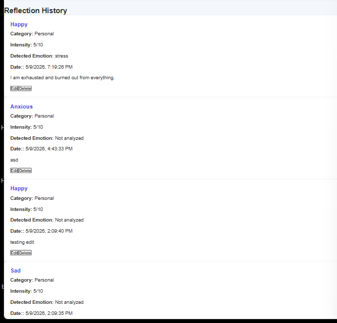
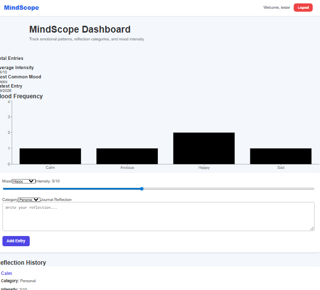
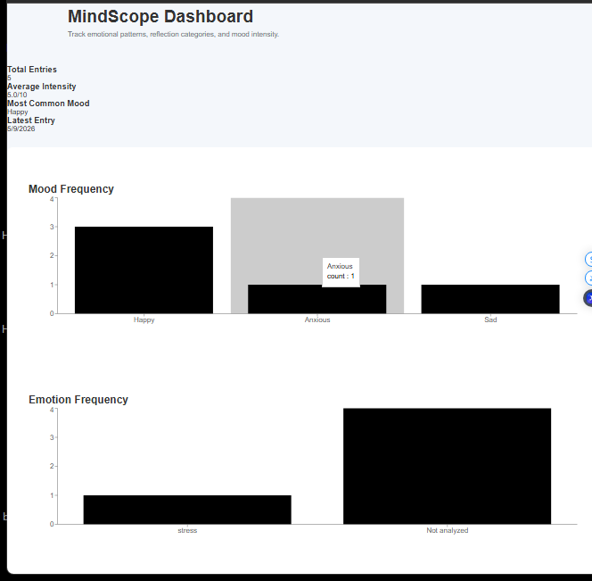

# 🧠 MindScope — Phase 5 NLP Emotion Analysis System

## 📊 Overview

MindScope is a full-stack MERN psychology dashboard that combines behavioral journaling, emotional tracking, and NLP-powered emotion analysis.

Phase 5 introduces a Python Flask microservice that analyzes journal reflections and detects emotional patterns using keyword-based NLP logic.

Users can now:

* Track moods manually
* Write journal reflections
* Analyze emotional tone automatically
* Visualize mood frequency
* Visualize detected emotions
* Compare self-reported mood vs detected emotion

---

## 🏗️ Tech Stack

### Frontend

* React
* Axios
* Recharts
* CSS

### Backend

* Node.js
* Express.js
* JWT Authentication
* Axios

### Database

* MongoDB
* Mongoose

### NLP / Machine Learning Service

* Python
* Flask
* Flask-CORS

---

## ⚙️ Phase 5 Features

### Mood Tracking

Users can:

* Select moods
* Set emotional intensity
* Choose life categories
* Write journal reflections

---

## ⚙️ NLP Emotion Analysis

Journal text is analyzed automatically using a Flask microservice.

Detected emotions include:

* Anxiety
* Stress
* Sadness
* Anger
* Positive
* Neutral

---

## Analytics Dashboard

Includes:

* Mood frequency chart
* Emotion frequency chart
* Emotion tagging on entries

---

## Secure User System

* JWT authentication
* Protected routes
* User-specific entries

---

## 🧠 NLP Workflow

```text
React Frontend
      ↓
Express Backend
      ↓
Flask NLP Service
      ↓
Emotion Detection
      ↓
MongoDB Storage
      ↓
Frontend Visualization
```

---

## 📁 Project Structure

```text
mindscope/
│
├── client/                 # React frontend
│
├── server/                 # Express backend
│
├── ml-service/             # Flask NLP service
│   ├── app.py
│   ├── emotionAnalyzer.py
│   ├── requirements.txt
│   └── venv/
│
└── README.md
```

---

## ⚙️ Features

* Create mood entries
* Store journal logs
* REST API architecture
* MongoDB database integration
* Modular backend structure
* Full CRUD-ready architecture

---

## 🚀 Installation

### 1. Clone Repository

```bash
git clone <repo-url>
```

---

### 2. Backend Setup

```bash
cd server
npm install
npm run dev
```

---

### 3. Frontend Setup

```bash
cd client
npm install
npm start
```

---

### 4. ML Service Setup

```bash
cd ml-service
python -m venv venv
venv\Scripts\activate
pip install flask flask-cors
pip freeze > requirements.txt
python app.py
```

---

## 🔐 Environment Variables

Create `.env` inside `server/`

```env
PORT=5000
MONGO_URI=mongodb://localhost:27017/mindscope
```

---

## 📡 API Routes
### Health Check

| Method | Route              | Description   |
| ------ | ------------------ | ------------- |
| GET   | /health             | Register user |
| POST   | /api/auth/login    | Login user    |

### Health Check

| Method | Route    | Description   |
| ------ | -------- | ------------- |
| GET    | /health  | Register user |
| POST   | /analyze | Login user    |        

---

## 🔒 Authentication Flow

MindScope uses JWT authentication for secure user sessions.

### Authentication Features
* JWT token authentication
* Protected routes
* User-specific entries
* Secure API access

---

## 📈 Charts
## Mood Chart

Displays:

* User-selected moods
* Mood frequency

Examples:

* Happy
* Sad
* Calm
* Angry
* Motivated

---

## Emotion Chart

Displays:

* NLP-detected emotions
* Emotional pattern frequency

Examples:

* Anxiety
* Stress
* Positive
* Neutral


---

## 🧠 Psychology Concepts

* Emotional self-monitoring
* Behavioral tracking
* Mood analysis
* Emotional journaling
* Reflection analysis
* Mood trend visualization
* Emotional awareness development

---

## 📱 Responsive Design

The application includes:

* Mobile-friendly layout
* Responsive navigation
* Flexible dashboard components
* Adaptive spacing and typography

---

## 🎯 Future Improvements

* Advanced analytics dashboard
* Correlation charts
* Mood vs emotion comparison
* Emotional trend timelines
* AI recommendations
* Sentiment scoring
* Real NLP models
* Data export
* PDF reports
* Calendar view
* Predictive emotional analysis

---

## 🎓 Learning Objectives

This project was built to improve:

- Full-stack engineering
- REST API architecture
- Cross-service communication
- MongoDB integration
- Emotion analysis systems
- Data analytics foundations

---

## 📸 Screenshots

### Dashboard



### Mood Analytics 



### Emotion Analytics 



---

## 👨‍💻 Author
Horatio Hanley

- Psychology Student @ SNHU
- Full-Stack MERN Developer
- Behavioral Analytics & Psychology Technology Enthusiast
