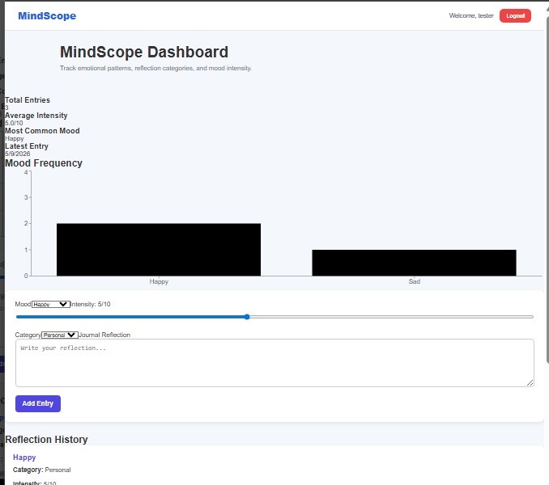
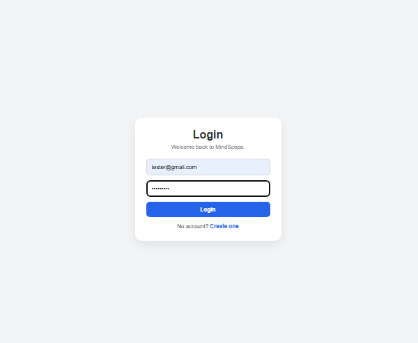
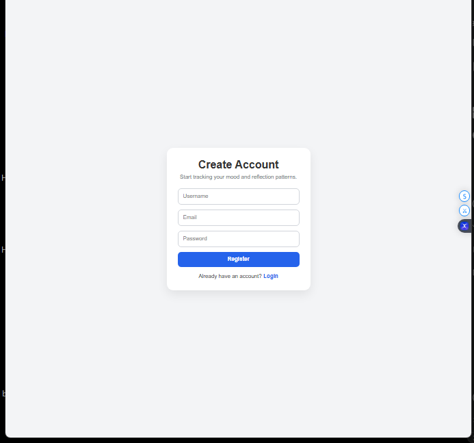
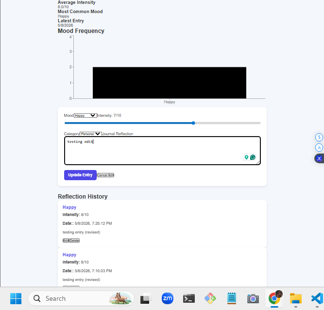

# 🧠 MindScope — MERN Psychology Dashboard

## 📊 Overview

MindScope is a MERN stack web application that combines psychology and software engineering to help users:

* Track moods
* Log journal entries
* Analyze emotional patterns
* Visualize behavioral trends

---

## 🏗️ Tech Stack

### Frontend

* React
* Axios

### Backend

* Node.js
* Express.js

### Database

* MongoDB
* Mongoose

---

## 📁 Project Structure

```text
client/
server/
```

---

## ⚙️ Features

* Create mood entries
* Store journal logs
* REST API architecture
* MongoDB database integration
* Modular backend structure
* Full CRUD-ready architecture

---

## 🚀 Installation

### 1. Clone Repository

```bash
git clone <repo-url>
```

---

### 2. Backend Setup

```bash
cd server
npm install
npm run dev
```

---

### 3. Frontend Setup

```bash
cd client
npm install
npm start
```

---

## 🔐 Environment Variables

Create `.env` inside `server/`

```env
PORT=5000
MONGO_URI=mongodb://localhost:27017/mindscope
```

---

## 📡 API Routes
### Authentication Routes

| Method | Route              | Description   |
| ------ | ------------------ | ------------- |
| POST   | /api/auth/register | Register user |
| POST   | /api/auth/login    | Login user    |

## Entry Routes

| Method | Route              | Description          |
| ------ | ------------------ | -------------------- |
| GET    | /api/entries       | Get all user entries |
| GET    | /api/entries/:id   | Get single entry     |
| POST   | /api/entries       | Create entry         |
| PUT    | /api/entries/:id   | Update entry         |
| DELETE | /api/entries/:id   |	Delete entry         |

---

## 🔒 Authentication Flow

MindScope uses JWT authentication for secure user sessions.

### Authentication Features
* Password hashing with bcryptjs
* JWT token generation
* Protected backend middleware
* Protected frontend routes
* User-specific database queries
* Automatic login persistence
* Logout session clearing

---

## 📊 Dashboard Analytics

The dashboard provides:

* Total entry count
* Average emotional intensity
* Most common mood
* Latest journal activity
* Mood frequency visualization

---

## 🧠 Psychology Concepts

* Emotional self-monitoring
* Behavioral tracking
* Mood analysis
* Emotional journaling
* Reflection analysis
* Mood trend visualization
* Emotional awareness development

---

## 📱 Responsive Design

The application includes:

* Mobile-friendly layout
* Responsive navigation
* Flexible dashboard components
* Adaptive spacing and typography

---

## 🎯 Future Improvements

* AI emotion detection
* NLP journal analysis
* Behavioral insights engine
* Burnout detection
* Habit correlation tracking
* PDF report generation
* Weekly analytics summaries
* Research export mode
* Deployment to Vercel + Render
* Tailwind CSS migration
* Framer Motion animations

---

## 🎓 Learning Objectives

This project was built to improve:

- MERN stack development
- REST API architecture
- MongoDB integration
- React state management
- Data visualization
- Psychology-oriented analytics
- CRUD application architecture
- Authentication systems
- JWT authorization
- Frontend routing
- Responsive design
- Full-stack application architecture

---

## 📸 Screenshots

### Dashboard



### Mood Analytics 


### Login Page



### Register Page



### Edit Entry



---

## 👨‍💻 Author
Horatio Hanley

- Psychology Student @ SNHU
- Full-Stack MERN Developer
- Behavioral Analytics & Psychology Technology Enthusiast
