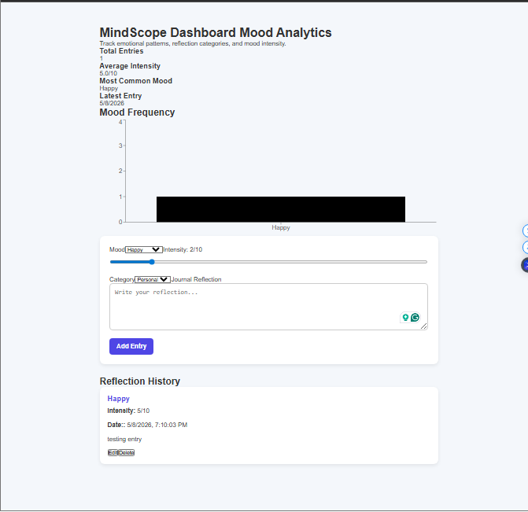
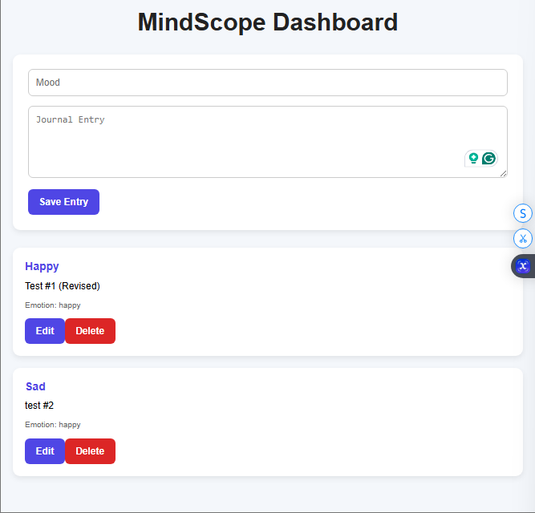
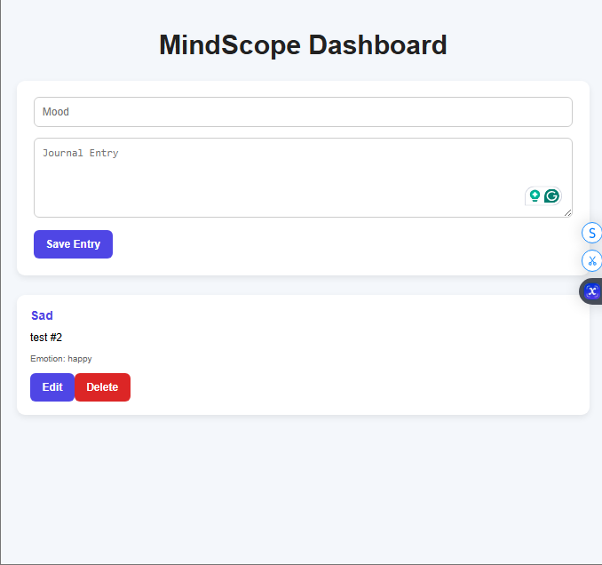

# 🧠 MindScope — MERN Psychology Dashboard

## 📊 Overview

MindScope is a MERN stack web application that combines psychology and software engineering to help users:

* Track moods
* Log journal entries
* Analyze emotional patterns
* Visualize behavioral trends

---

## 🏗️ Tech Stack

### Frontend

* React
* Axios

### Backend

* Node.js
* Express.js

### Database

* MongoDB
* Mongoose

---

## 📁 Project Structure

```text
client/
server/
```

---

## ⚙️ Features

* Create mood entries
* Store journal logs
* REST API architecture
* MongoDB database integration
* Modular backend structure
* Full CRUD-ready architecture

---

## 🚀 Installation

### 1. Clone Repository

```bash
git clone <repo-url>
```

---

### 2. Backend Setup

```bash
cd server
npm install
npm run dev
```

---

### 3. Frontend Setup

```bash
cd client
npm install
npm start
```

---

## 🔐 Environment Variables

Create `.env` inside `server/`

```env
PORT=5000
MONGO_URI=mongodb://localhost:27017/mindscope
```

---

## 📡 API Routes

### Get Entries

```text
GET /api/entries
```

### Create Entry

```text
POST /api/entries
```

---

## 🧠 Psychology Concepts

* Emotional self-monitoring
* Behavioral tracking
* Mood analysis
* Emotional journaling

---

## 🎯 Future Improvements

* Authentication
* AI emotion detection
* Charts & analytics
* JWT authorization
* Deployment
* Mobile responsiveness

---

## 🎓 Learning Objectives

This project was built to improve:

- MERN stack development
- REST API design
- MongoDB integration
- React state management
- Full CRUD functionality

---

## 📡 API Routes

| Method | Route | Description |
|---|---|---|
| GET | /api/entries | Get all entries |
| GET | /api/entries/:id | Get single entry |
| POST | /api/entries | Create entry |
| PUT | /api/entries/:id | Update entry |
| DELETE | /api/entries/:id | Delete entry |

---

## 📸 Screenshots

### Dashboard


### Entry



### Edit Entry


### Update Entry



### Delete Entry



---

## 👨‍💻 Author
Horatio Hanley
